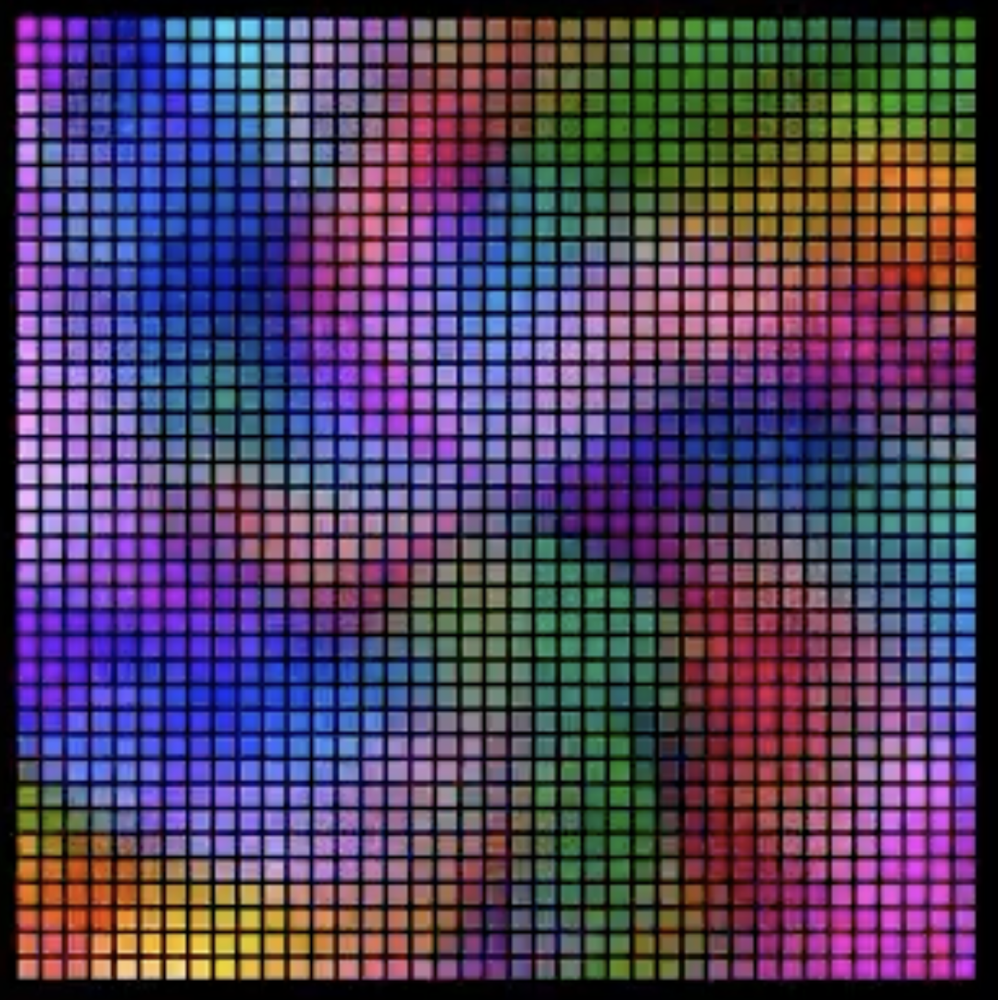

# AnimARTrix

by Stefan Petrick. High quality LED animations for your project. 

This is a Shader & a 5D Coordinate Mapper made for rendering artistic visuals & generative animations. 

                                                   

f you would like to support my work [I welcome your kind donation](https://www.paypal.com/donate/?hosted_button_id=YR7Q795MYU9HS).

--------------------------------------------------------------------------------------------

__Info for Early Adopters: Install *.ino in one folder and run animartrix_v02.ino__

--------------------------------------------------------------------------------------------

For examples what this code can do check out my Youtube: https://www.youtube.com/@stefanpetrick

My own posts reporting development progress can be found here: https://www.reddit.com/user/StefanPetrick/submitted/

A big thank you to Sutaburosu, Antti Yliniemi & Yves Bazin for the kind support!

Required software: 

Arduino IDE
https://www.arduino.cc/en/software

Teensyduino
https://www.pjrc.com/teensy/td_download.html

FastLED
https://github.com/FastLED/FastLED

Recommended hardware: 

Any fast FPU microcontroller & lots of programmamble LEDs

For best results use a Teensy 4: https://www.pjrc.com/store/teensy40.html

The code and animations are licenced under a Creative Commons Attribution License CC BY-NC-SA 4.0

https://creativecommons.org/licenses/by-nc-sa/4.0/

